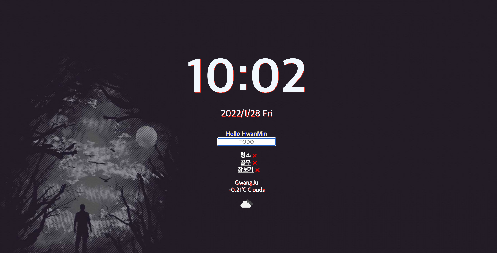

# JS를 이용한 TODO_List 

## 기능 
1. Math.Random() 함수를 이용해서 랜덤하게 바뀌는 배경
2. new Date() , timeInterVal() 이용한 실시간 시계
3. LocalStorage() 이용한 브라우저 TODO-list 저장 및 삭제 
4. navigator.geolocation.getCurrentPosition()을 이용한 사용자 위도 경도 가져오기 
5. https://api.openweathermap.org/ API를 사용해서 사용자 지역 및 기온 날씨 알림 
6. 추가적으로 API CODE 값을 이용해 밑에 날씨 ICON이 사용자 위치 날씨에 따라 변함 

## 배운점
1.LocalStorage  
String 형식만 지원한다는 점에서 한번 막혔다.
JSON.Parse() , JSON.stringify() 통해서 위 문제를 해결.  
2. new Date() 에서 요일을 가져오는 경우 if문 대신 Switch문을 사용해봄   확실히 요일을 가져오는 부분에 있어서 Switch문이 if문에 비해서 눈으로 봤을때 로직이 훨씬 깔끔함. 
3. LocalStrage를 갱신하는 부분에 있어서 배열에 있는 내용을 todo-list id값으로 확인해서 갱신 하는데 이때 filter를 사용함에 있어서 filter는 새로운 배열을 생성하는 것을 모르고
업데이트가 한동안 안되는 현상 발생   -> return 된 값을 다시 받고 LocalStorage에 저장함으로서 해결 

